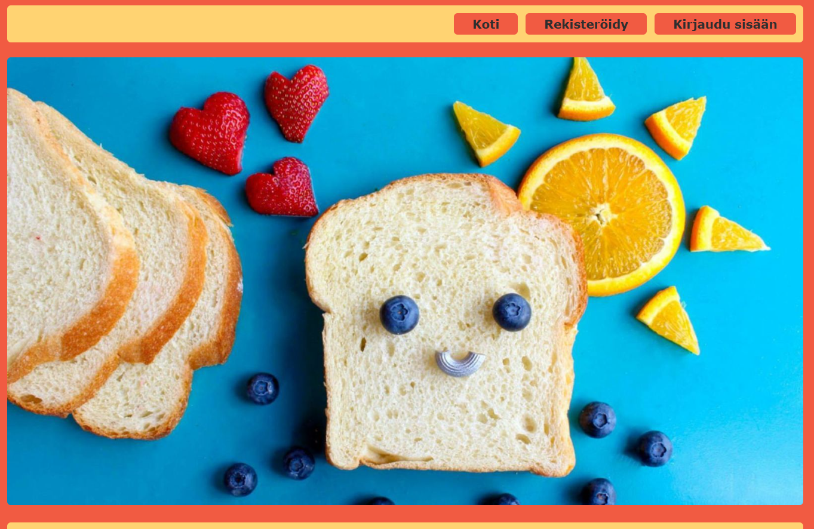
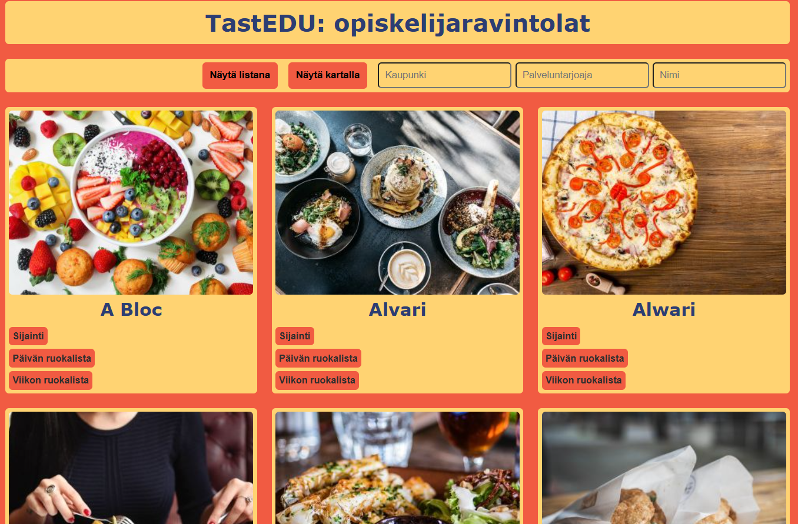
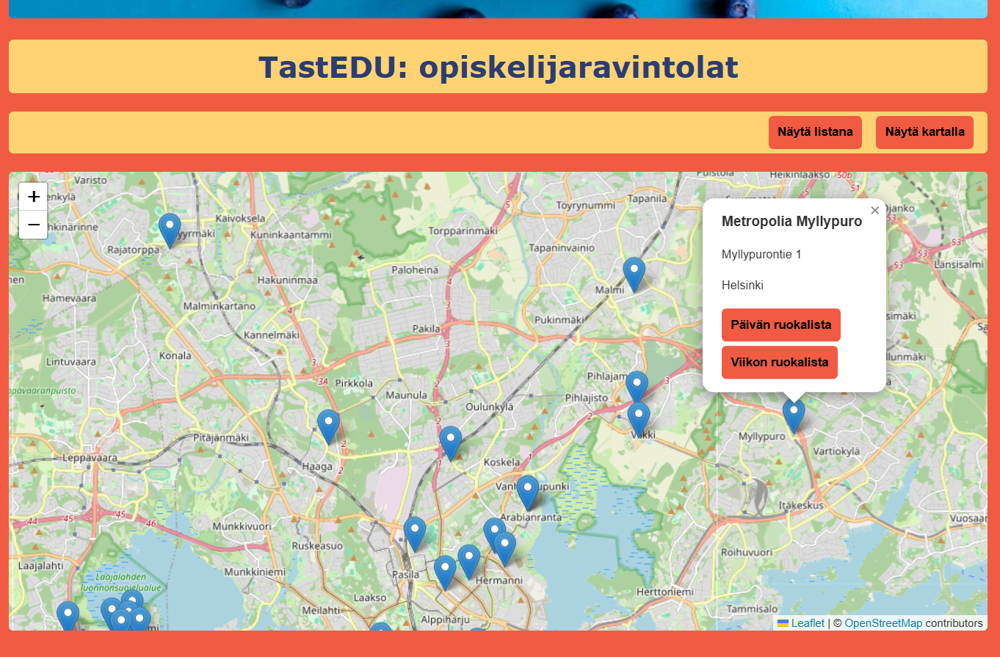
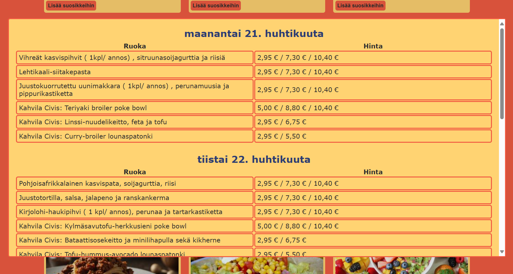
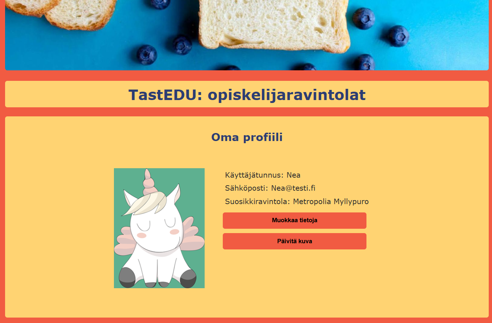
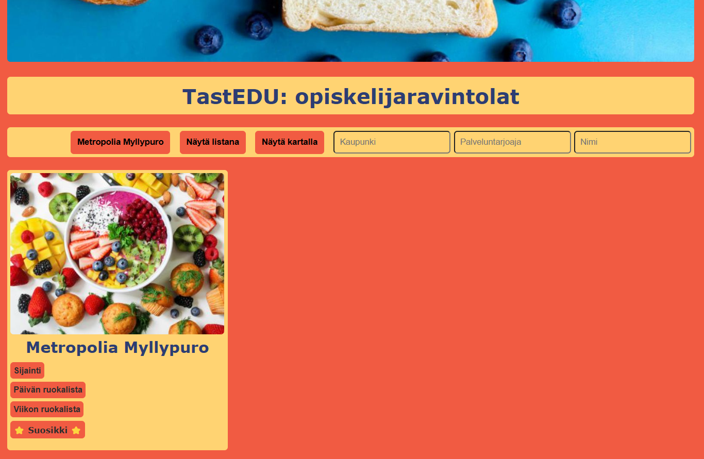

# TastEDU – Student Restaurant App

📄 Tämä dokumentaatio on saatavilla myös [suomeksi](README.md).

This app was developed as part of an individual assignment for the _Web Application Development_ course.

> 📲 **[Open the TastEDU app here](https://users.metropolia.fi/~neal/WSK/individual-assignment/)**

> (⚠️Note! The app only works within the Metropolia network or with a VPN connection, as it uses an internal API.)

---

## 🧠 App Idea and Target Audience

TastEDU is a web application designed to make students' daily lives easier by providing a clear and fast way to find student restaurants, view menus, and choose a favorite restaurant. The app uses a map and a list view, allowing users to explore restaurants visually or by browsing.

---

## ⚙️ Features

- 🔎 **Browse restaurants** in a list or on a map
- 🧭 **Search functionality** by name, city, and service provider
- 🍽️ **Menus** for the day and week
- ⭐ **Save a favorite restaurant**
- 👤 **User profile management**
- 🗺️ **Map view with user location**
- 📱 **Responsive UI for mobile devices**

---

## 🔐 Authentication

Users can:

- Register with a username and password
- Log in and log out
- View and edit their personal information
- Delete their account
- Save a favorite restaurant to their profile

Authentication is handled using JWT tokens, and user data is stored in `localStorage` during the session.

---

## 💻 About the Development

The app is built without external front-end frameworks (like React or Vue). The aim was to practice pure HTML/CSS/JavaScript (ES6+) development and focus on:

- Modular code structure (JavaScript ES6 import/export)
- Using REST APIs (GET, POST, PUT, DELETE)
- Manual DOM manipulation and event handling
- Designing a responsive UI for mobile
- Implementing map-based navigation with Leaflet.js
- Since the API doesn't provide restaurant images, generic placeholder images are used to improve visuals

---

## 💻 Technologies and Libraries

- HTML, CSS, JavaScript (ES6+)
- Leaflet.js (for map view)
- REST API (for restaurant and user data)
- LocalStorage (to store token)

> ℹ️ **Note:** The REST API used by this app is provided by Metropolia and is not developed as part of this project.

---

## 🧪 Other Implementations

In the early stages of the project, I developed a separate back-end using Node.js and Express for user management. It included a custom database for user registration and login. Later, it became clear that the assignment should utilize Metropolia’s existing API, so the Express implementation was left unused.

🔎 This alternative version is still available to inspect in the [`express`](https://github.com/nealukumies/WSK-restaurantapp/tree/express) branch. It demonstrates:

- A REST API built with Express.js
- User registration and login with a MySQL database
- JWT-based authentication
- Password hashing using the bcrypt library
- Development environment using Nodemon

---

## 📸 Screenshots

Not on the Metropolia network? No worries! Here are a few screenshots of the app:

_A cheerful logo welcomes the user! This is the view for unauthenticated users. Logged-in users have navigation buttons for Home, Profile, and Logout._

_The restaurant list view, where the user can browse restaurants and filter by city, provider, or name. Menus open in a modal window._

_The map view lets users explore restaurants geographically. Menus also open in a modal here._

_The menu view displays daily or weekly menus in a modal window._

_The user profile lets users view and edit their data. It also shows the user's favorite restaurant. The profile can be deleted, removing all user data from the server._

_If a favorite restaurant is selected, it can be filtered by name, showing only that restaurant in the list._

---
